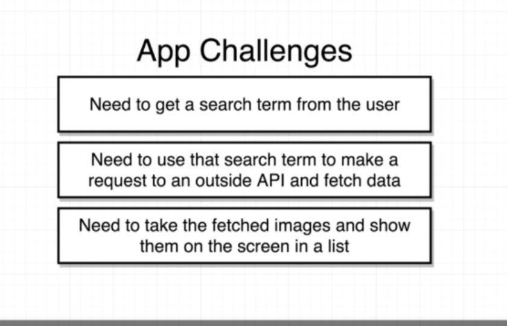
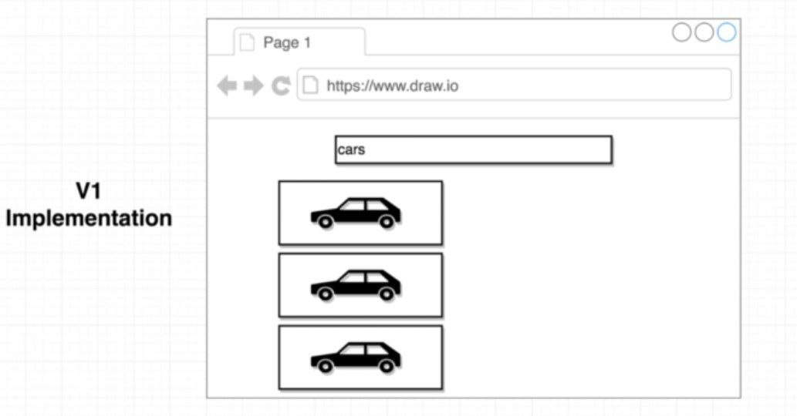

## Day 8

App challenge 

 </img>

We have to figure out how to solve the above problems .

Diagram view of the app 
View </img>

This diagram shows the basic view of the app that we are going to create.

## DAY 9 - Day 11

    These are the challenges that we have to face for craeting this app.

    Diagram of vi implementation which shows that the search bar gives us the desired result on the screen

    So for creating the app , we first have to divide our two basic components that we require for the app i:e search bar and the imagelist component

    After creating the component we have to fetch data from  API . This can be done by two ways. <code>Axios</code>
    <code>fetch</code>

    We have used axios in our app.

