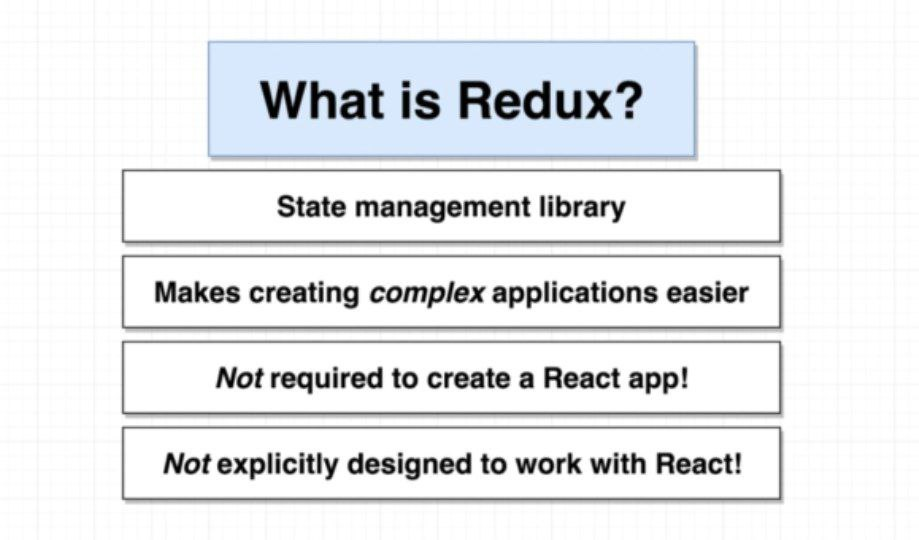
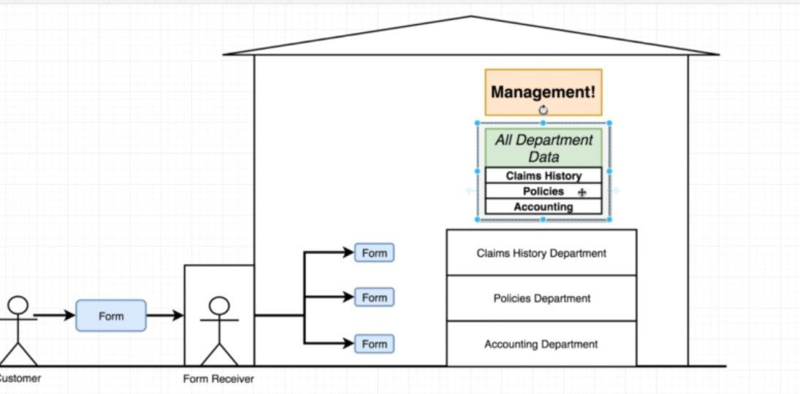

# redux 
What is redux? </img>

    Redux is a state management library . So with redux rather than authoring state or maintaining state inside of our react components we're going to instead extract it to this redux library. As React library itself is all about rendering content on the screen and handling user interactions. Its primary goal is not about maintaining , updating or otherwise handling data. So we're going to make redux in charge of handling data inside of our applications.

> You can still use react all by itself. But using redux library make it easier .

# redux cycle

 Redux cycle</img>

# App Structure and basic idea

Build an insurance company

basic idea of Insurance company</img>

Flow chart of the idea</img>

</img>

</img>

</img>
</img>
</img>
</img>
</img>

</img>
</img>

</img>

Completed the implementation of the app
<a href="https://codepen.io/arpit0498-the-vuer/pen/NWapejW?editors=0011">Code Pen link </a>