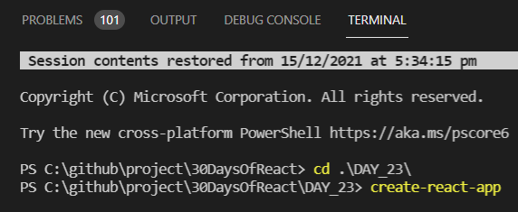
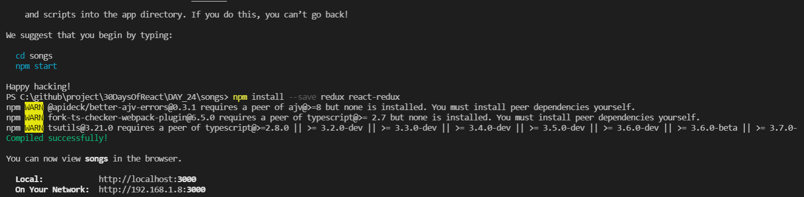

# Day 24 

Today understanding redux library in more details, started to create this simple react app songs. 

Basic App analogy</img>

    SO in terminal type the following commands in your destination folder

Create react app songs
 Install libraries

After these steps type   :
        
        cd songs

So for creating the song app we have to divide the song app into two major components

-SongList

-SongDetail

</img>

</img>