# 30DaysOfReact

Thirty days react challenge

## Day 1

<a href="https://6v5nq.csb.app/#"> Language converter</a>

### Code

<a href="./DAY_01/language converter/"> Code link</a>

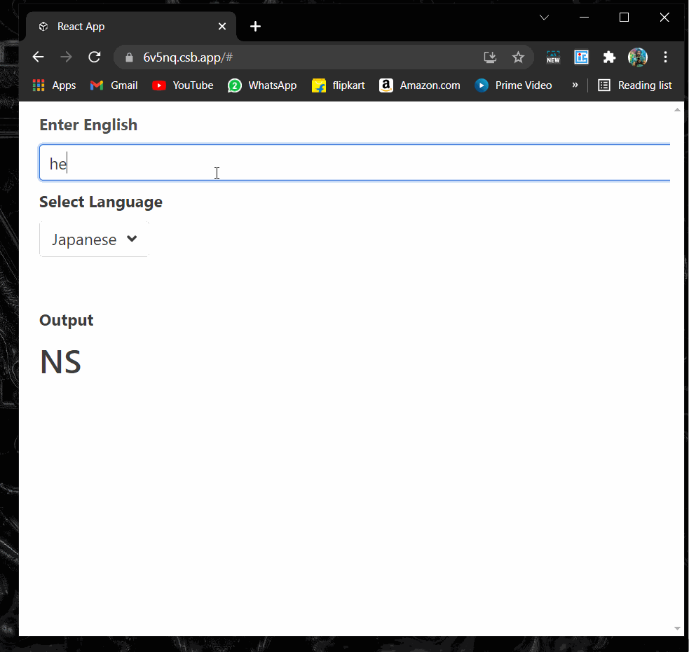 Converter</img>

## Day 2 

Today learn how to install node and create react app in local machine .

### Code

<a href="./DAY_02/"> Code link</a>

### Cousre

<a href="https://www.udemy.com/course/react-redux/"> Udemy course link</a>

## Day 3
Today completed  <code>section #3</code> of the course . 

    .Components in jsx
    .How to use props in react

### Code

<a href="./DAY_03/"> Code link</a>

### Cousre

<a href="https://www.udemy.com/course/react-redux/"> Udemy course link</a>

## Day 4
Our final app is that tells user the current season in their location based on the location of user and the month given by them.

    Learnings:>
    class functions
    geolocation api

Today completed half part of the app in which we take location of user as input . 

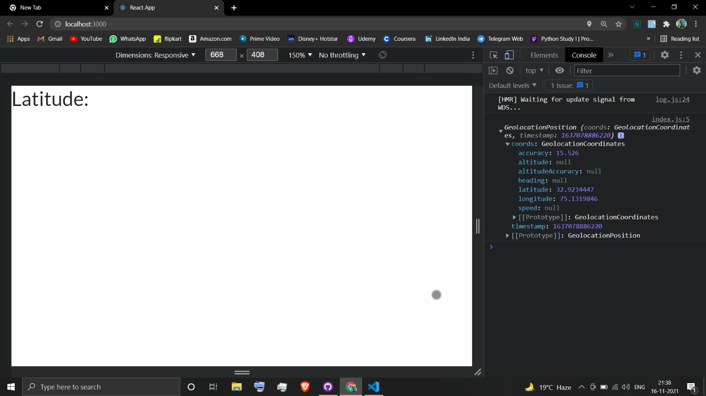Screen shot</img>

### Code

<a href="./DAY_04/"> Code link Day 4</a>

### Cousre

<a href="https://www.udemy.com/course/react-redux/"> Udemy course link</a>

## Day 5, 6 & 7

    Lifecycle methods
    React states 
    class component
    function components

Completed the app 

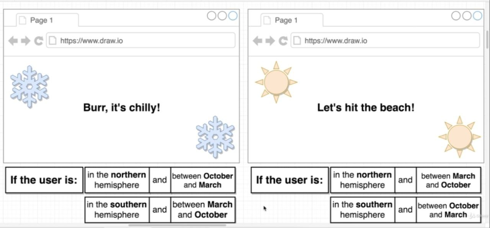App challenge </img>

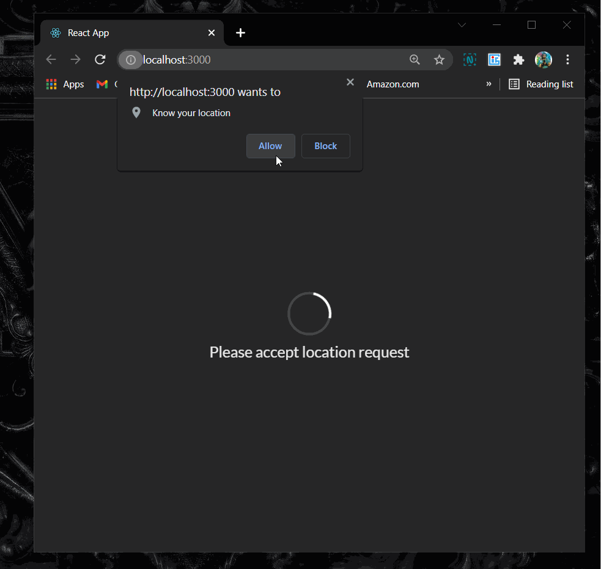

### Code

<a href="./DAY_04/"> Code link </a>

## Day 8

App challenge 

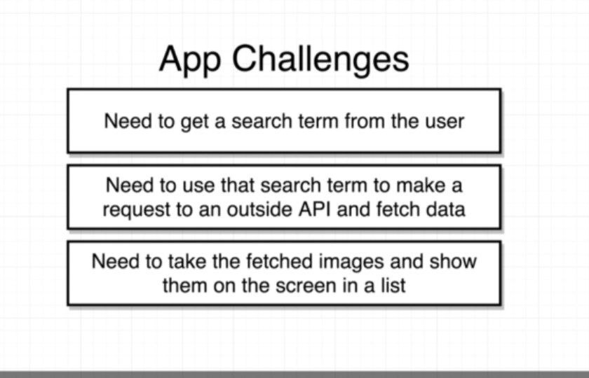 </img>

We have to figure out how to solve the above problems .

Diagram view of the app 
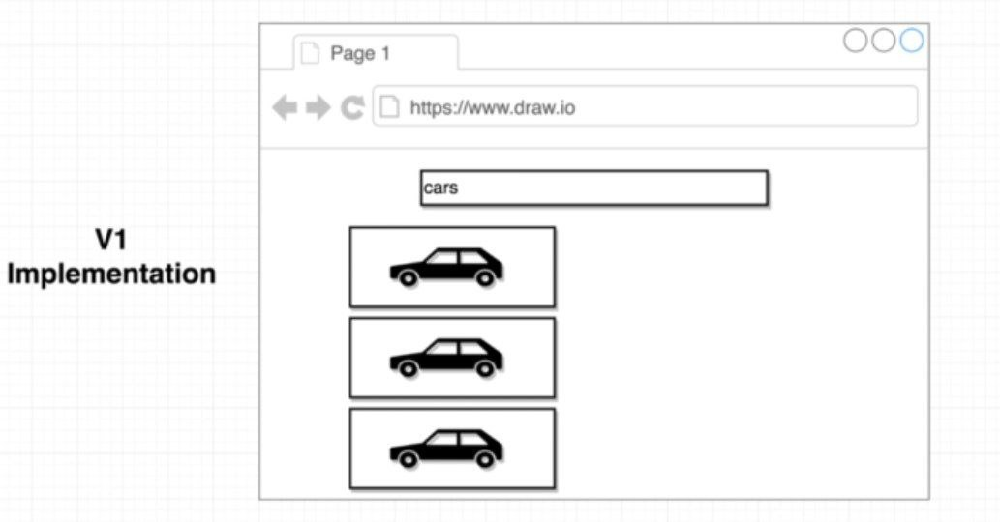View </img>

This diagram shows the basic view of the app that we are going to create.

## Day 9- Day 11

<a href="./DAY_08/pics/README.md">Day 9- day 11</a>

completed the app challenge v1 and v2 implementation

</img>
in the first part we just have to fetch image from the API and display them on the screen

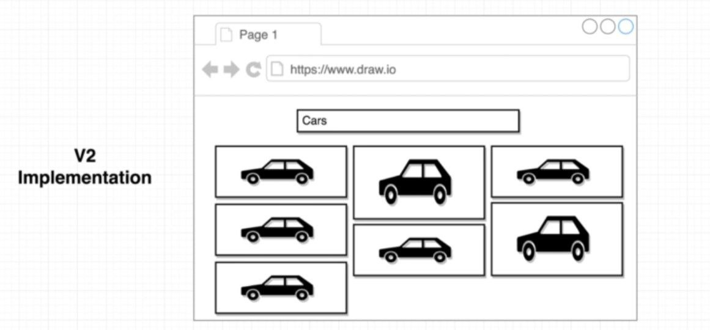</img>

During the v2 implementation we have to display images in proper orientation . we have used js and css grid for that. 

completed project</img>

Small gif of the project is attached .

### Code

<a href="./DAY_08/pics/"> project Code link</a>

## Day 12

        learn basics of hooks
        useState
        useEffect
        useRef

## Day 13
    started first project on hooks

## Day 14
    Hooks are away to write reusable cod, instead of more classic technique like inheritance

completed first part of the project i:e Accordion widget

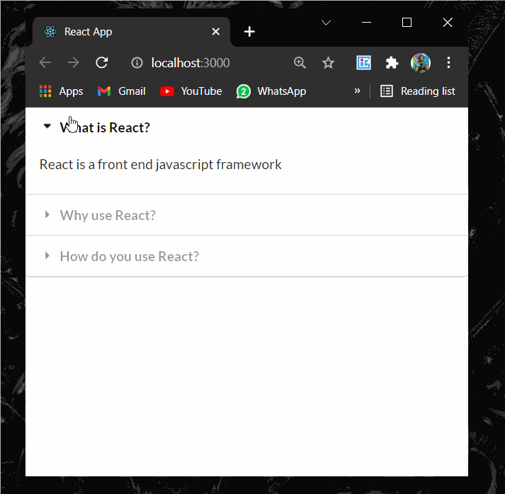Accordion widget</img>

## Day 15

completed search part of the app

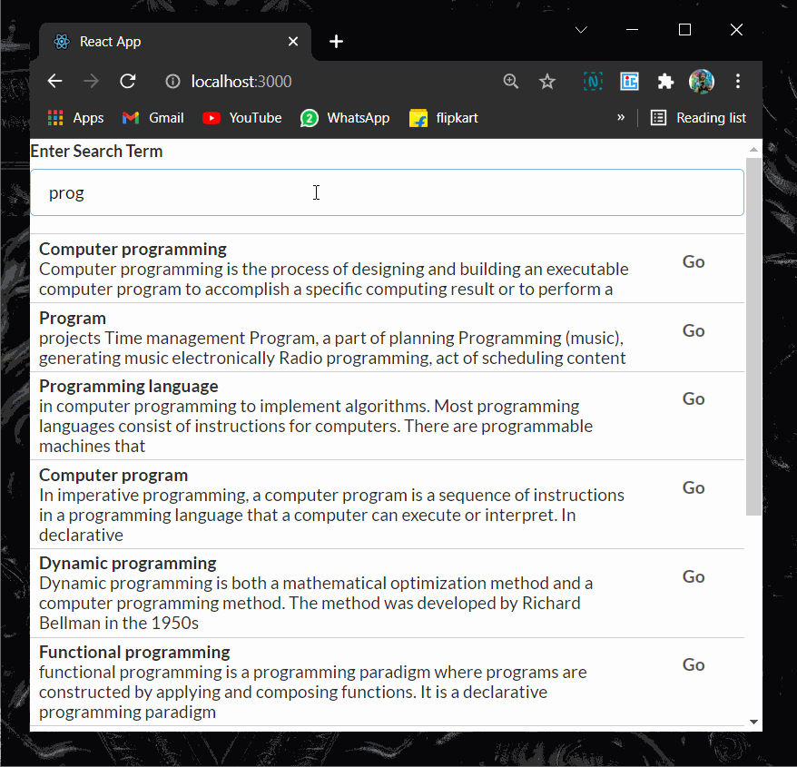 </img>

## Day 16 
completed all four parts of the app

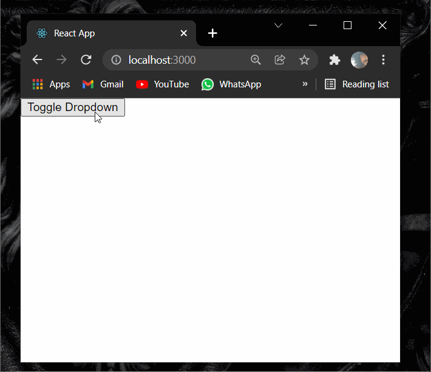 Toggle down</img>

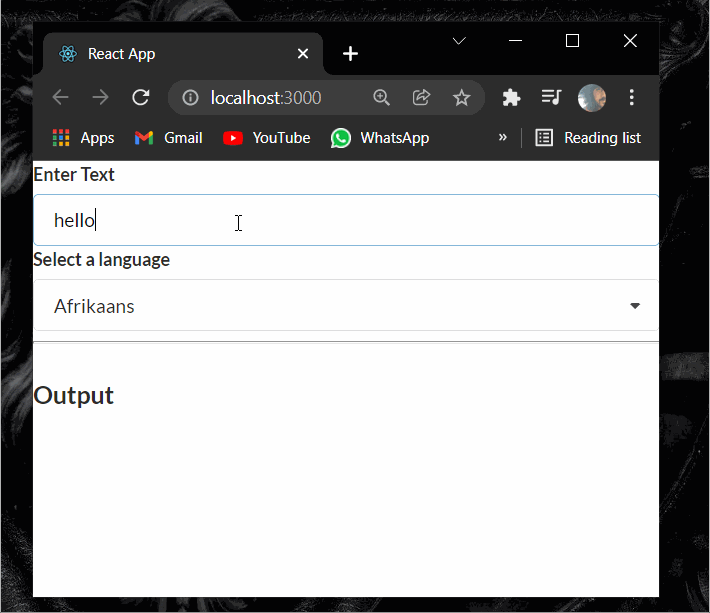 Language translator</img>

# Day 17

completed the app along with navigation

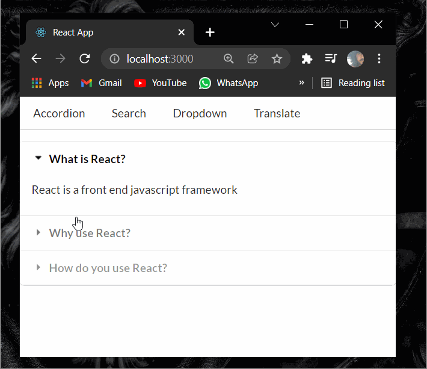 project</img>
